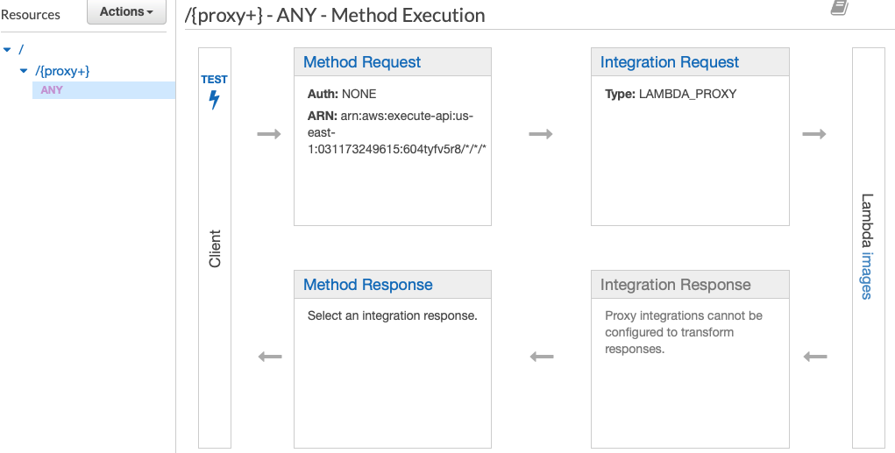

Lambda method is highly tedious as the Lambda method forces you to define headers, status code and so on in the configuration of each API Gateway Endpoint (not in the code).

AWS-PROXY or Lambda-PROXY automatically passes the content of the HTTP request into the corresponding Lambda function and allows you to configure response with headers, status codes and so on in the Lambda code itself.

The following is the snapshot of AWS-Proxy from API Gateway (AWS).



## For local development.

### Start Docker DynamoDB.

```
docker-compose up dynamo
```

### Start Server

```
make dev-run
```

### Build and run Client

```
make dev-crun
```

### Client runs with

```
./build/client -h
```

## Run DynamoDB GUI client (useful)

https://github.com/Arattian/DynamoDb-GUI-Client

## For AWS depolyment.

Terraform is used for infrastructure build and initial deployment.
Terraform version >= 0.12

```
make prod-build
cd terraform
terraform init
terraform apply -var-file="main.tfvars"
```

## Reference:

https://github.com/nerdguru/go-sls-crudl
https://github.com/developmentseed/tf-lambda-proxy-apigw
https://learn.hashicorp.com/terraform/aws/lambda-api-gateway
https://www.alexedwards.net/blog/serverless-api-with-go-and-aws-lambda
